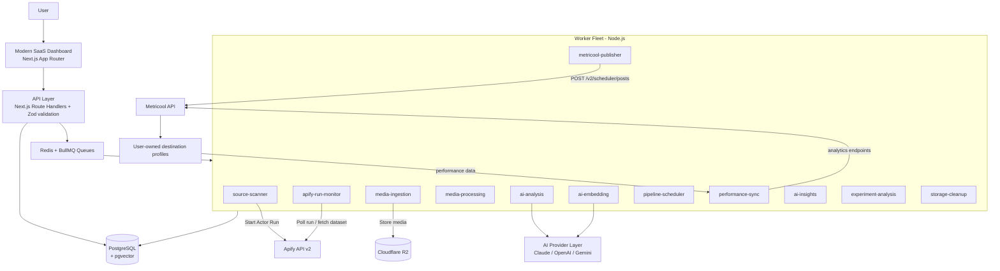
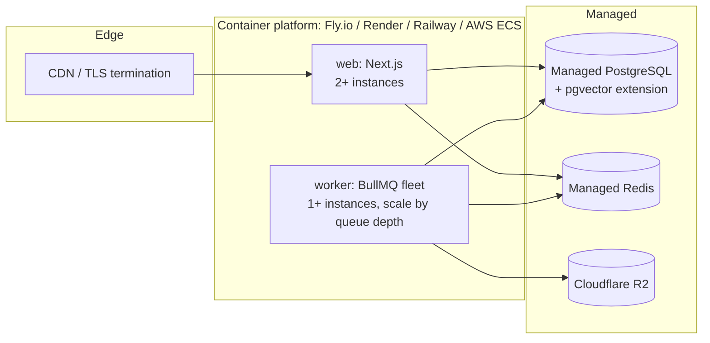

# 1. System Architecture

## High-level architecture



## Data flow (the learning loop)

```
AUTHORIZED SOURCE PROFILES
  → APIFY CONTENT INGESTION           (source-scanner + apify-run-monitor)
  → GLOBAL MEDIA LIBRARY              (media-ingestion: dedupe, download, R2)
  → AI CONTENT ANALYSIS               (ai-analysis: structured JSON analysis)
  → AI CONTENT SCORING                (ai-analysis: explainable 0-100 score)
  → PIPELINE ROUTING                  (pipeline_media pools, per-pipeline status)
  → AI CAPTION / HASHTAG OPTIMIZATION (brand-voice-aware generation)
  → PIPELINE SCHEDULING               (pipeline-scheduler: slots, diversity rules)
  → METRICOOL                         (metricool-publisher)
  → USER-OWNED DESTINATION PROFILES
  → PERFORMANCE DATA                  (performance-sync: T+0/1h/6h/24h/72h)
  → AI PERFORMANCE ANALYSIS           (ai-insights: stats first, AI interprets)
  → WINNER DETECTION + A/B TESTING    (experiment-analysis)
  → AI LEARNING LOOP                  (content intelligence profile per destination)
  → BETTER FUTURE CONTENT SELECTION   (ranker uses updated profile + insights)
```

## Design principles

1. **Pipeline isolation.** Every pipeline has its own content pool, schedule, brand voice, destination and AI settings. Failures are isolated per-pipeline (per-job error boundaries; one pipeline's failing jobs never block another's queue processing — BullMQ jobs are independent and retried with backoff).
2. **Single ingestion, multi-distribution.** A source assigned to N pipelines is scanned **once**; results land in the global media library and are fanned out to each pipeline's pool.
3. **Async everything.** No API request ever blocks on Apify, Metricool, FFmpeg or an AI provider. API handlers enqueue jobs and return job IDs; the UI observes job status.
4. **Stats before AI.** The backend computes statistical aggregates; AI providers interpret them. AI never invents performance numbers.
5. **Explainability.** Every score, recommendation and insight carries: reason, evidence, sample size, confidence, date range.
6. **Compliance by construction.** Only official APIs; sources must be marked as authorized by the user; no bypass mechanisms exist anywhere in the codebase.

## Cloud deployment



- **Two container images** from one repo: `Dockerfile` (web) and `Dockerfile.worker` (workers). Same codebase, different entrypoints.
- **Horizontal scaling:** web scales on request load; workers scale on queue depth. Both are stateless — all state lives in Postgres/Redis/R2.
- **No local computer required:** scanning, analysis, scheduling and publishing all run in cloud workers on cron/queue triggers.
- **Migrations:** `prisma migrate deploy` runs as a release step before new containers receive traffic.
- **Observability:** pino structured logs → log drain; BullMQ metrics + job table in Postgres surfaced in the `/jobs` UI; health endpoints for both processes.

## Folder structure

```
contentloop/
├── docs/                      # this documentation
├── legal/                     # AUP, ToS
├── prisma/
│   └── schema.prisma          # full data model (see 02-data-model.md)
├── docker-compose.yml         # local Postgres(pgvector) + Redis
├── Dockerfile                 # web image
├── Dockerfile.worker          # worker image
├── src/
│   ├── middleware.ts          # session guard
│   ├── app/
│   │   ├── (auth)/            # login, register
│   │   ├── (app)/             # authenticated shell: dashboard, pipelines,
│   │   │                      # sources, content, calendar, analytics,
│   │   │                      # experiments, ai, integrations, jobs, settings
│   │   └── api/               # route handlers (see 03-api-spec.md)
│   ├── components/
│   │   ├── ui/                # design system primitives
│   │   └── layout/            # sidebar, topbar
│   ├── lib/
│   │   ├── env.ts             # zod-validated environment
│   │   ├── db.ts              # Prisma singleton
│   │   ├── auth/              # password hashing, JWT sessions
│   │   ├── apify/             # client, actor/run/dataset services, normalizer
│   │   ├── metricool/         # official-API client
│   │   ├── ai/                # provider abstraction, routing, usage tracking
│   │   ├── storage/           # R2 (S3-compatible)
│   │   ├── media/             # hashing, dedupe helpers
│   │   ├── scoring/           # ranking + diversity engine
│   │   └── queue/             # BullMQ queues + connection
│   └── workers/               # one file per worker + bootstrap index
└── package.json
```
