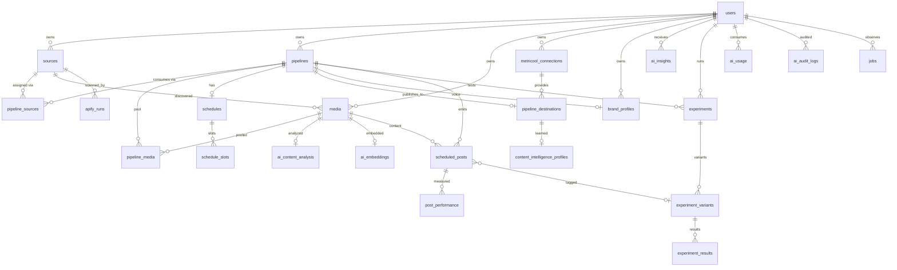

# 2. Data Model

Authoritative schema: [`prisma/schema.prisma`](../prisma/schema.prisma). PostgreSQL with the `vector` (pgvector) extension.

## ERD (core relations)

## Table catalog

### Identity & config
- **users** — account, password hash, plan, autopilot defaults, AI data-consent flags (`allowAiAnalysis`, `allowAiPerformance`, `allowAiCaptions`, `allowAiRecommendations`).
- **settings** — per-user key/value settings (JSON values).
- **usage_records** — plan-limit metering (pipelines, sources, scans, posts, AI tokens per period).

### Ingestion
- **sources** — authorized source profile: name, url, platform, status, monitoring frequency, last scan, counters, `authorizationConfirmedAt` (user attests reuse rights — required before scanning).
- **apify_runs** — every Actor run: actorId, runId, status, datasetId, itemsFound/imported, error. Guarantees "never two concurrent scans for one source" and idempotent monitoring.
- **media** — global media library (one physical record per unique content). Dedupe keys: `(platform, platformMediaId)`, `canonicalUrl`, `contentHash`. Holds storage keys (R2), dimensions, duration, caption, hashtags, `aiAnalysisStatus`, `aiScore`.

### Pipelines
- **pipelines** — name, status, goal (REACH/ENGAGEMENT/FOLLOWERS/TRAFFIC/CONVERSIONS), timezone, AI settings (scoring, captions, hashtags, scheduling, recommendations, autopilot mode OFF/ASSISTED/AUTO), diversity rules (JSON), source allocation (JSON).
- **pipeline_sources** — M:N sources↔pipelines with per-pipeline filters and allocation weight.
- **pipeline_media** — per-pipeline content pool: status (AVAILABLE/QUEUED/SCHEDULED/PUBLISHED/SKIPPED/REJECTED), per-pipeline `aiScore`, `priority`, `reason`, timestamps. Same physical media can hold different statuses in different pools.
- **schedules / schedule_slots** — cadence per pipeline (slots = day-of-week × time, or frequency/day), timezone-aware, `aiOptimized` flag.
- **brand_profiles** — brand voice per pipeline (or user default): audience, tone, vocabulary, banned words, CTA style, emoji policy, language, dialect.

### Publishing
- **metricool_connections** — userToken (encrypted at rest), userId, blogId, connected profile metadata, status, lastCheckedAt.
- **pipeline_destinations** — pipeline → Metricool blog/provider network mapping (e.g. Instagram profile of blog X).
- **scheduled_posts** — the outbound unit: media, pipeline, destination, planned time, caption, hashtags, status (DRAFT/PENDING_APPROVAL/QUEUED/SENT_TO_METRICOOL/PUBLISHED/FAILED/CANCELLED), Metricool post id, experiment variant link.

### Performance & learning
- **post_performance** — periodic snapshots per scheduled post (views, reach, likes, comments, shares, saves, watchTime, completionRate, engagementRate, followersGained, collectedAt). Only metrics actually returned by the API are stored; absent metrics stay NULL.
- **ai_content_analysis** — structured JSON analysis per media + typed columns for hot fields (contentType, hookType, hookStrength, trendScore, audienceFit, predictedPerformance, confidence, provider, model).
- **ai_embeddings** — pgvector embedding per media/post for similarity search (`vector(1536)`, provider + model recorded).
- **ai_insights** — data-backed findings & recommendations: type (CONTENT_PATTERN, POSTING_TIME, SOURCE_PERFORMANCE, HOOK_PATTERN, CAPTION_PATTERN, AUDIENCE_PATTERN, RECOMMENDATION), title, summary, `evidenceJson`, confidence, sampleSize, dateRange.
- **content_intelligence_profiles** — learned profile per destination: best formats, durations, hooks, posting windows, CTAs, top source patterns + sample sizes and updatedAt.

### Experiments
- **experiments** — hypothesis, variable (CAPTION/HOOK/POSTING_TIME/HASHTAGS/THUMBNAIL/FORMAT/LENGTH/CTA), primary metric, status, dates, winner, confidence.
- **experiment_variants** — name + configuration JSON.
- **experiment_results** — aggregated metrics + sample size per variant.

### Ops & governance
- **jobs** — mirror of queue jobs for UI observability (queue, name, status, attempts, error, payload ref).
- **logs** — application event log (level, scope, message, context JSON).
- **ai_usage** — provider, model, input/output tokens, estimated cost, user, pipeline, request type.
- **ai_audit_logs** — every AI action: recommendation, reason, user action (approved/rejected/edited), result.

## Deduplication strategy

On ingestion, in order: (1) `platform + platformMediaId` unique hit → link, skip download; (2) canonical URL hit → link; (3) after download, SHA-256 `contentHash` hit → discard duplicate blob, link to existing storage key. Physical bytes are stored **once**; pipeline pools reference the global record.
