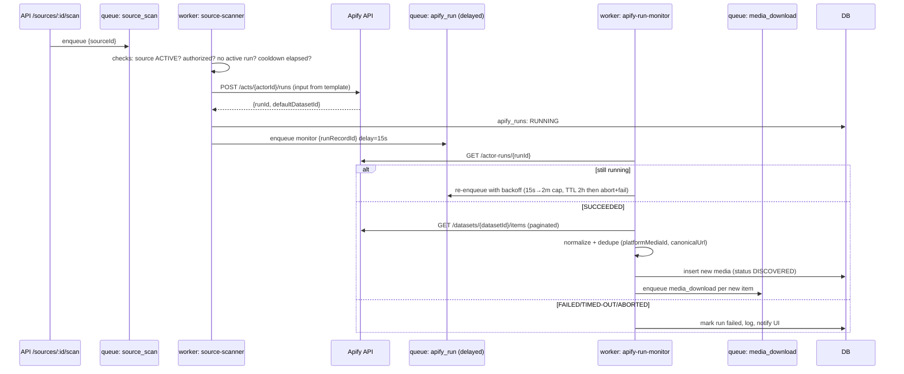

# 4. Apify Integration

Grounded in the official Apify API v2 (https://docs.apify.com/api/v2). Base URL `https://api.apify.com/v2`, authentication via `Authorization: Bearer <APIFY_API_TOKEN>` header (server-side only — the token never reaches the browser).

## Endpoints used

| Operation | Method + path |
|---|---|
| Start Actor run | `POST /v2/acts/{actorId}/runs` (body = Actor input JSON) |
| Get run status | `GET /v2/actor-runs/{runId}` |
| Abort run | `POST /v2/actor-runs/{runId}/abort` |
| Get dataset items | `GET /v2/datasets/{datasetId}/items?format=json&offset&limit` |
| Get Actor (validate config) | `GET /v2/acts/{actorId}` |

Run status values handled: `READY, RUNNING, SUCCEEDED, FAILED, TIMED-OUT, ABORTED, ABORTING`.

## Service layout (`src/lib/apify/`)

- **ApifyClient** — thin authenticated fetch wrapper: retries with exponential backoff + jitter on 429/5xx/network, honors `Retry-After`, request timeout, structured errors.
- **ApifyActorService** — resolve/validate configured Actor, fetch metadata.
- **ApifyRunService** — start run, get status, abort, `waitForFinishSeconds=0` (we never block).
- **ApifyDatasetService** — paginated item retrieval.
- **ApifyNormalizer** — maps raw dataset items → `NormalizedMediaItem`. **No Actor input schema is assumed**: input is produced from a per-source JSON template (`inputTemplate`, admin-configurable, with `{{url}}` / `{{username}}` / `{{limit}}` placeholders) and output field mapping is configurable (`fieldMap`), with sensible defaults for common Instagram-scraper Actor output shapes. Unknown fields are preserved in `raw`.

Environment:
```
APIFY_API_TOKEN=          # server-side only
APIFY_ACTOR_ID=           # configurable, e.g. "apify~instagram-reel-scraper" — operator must consult the chosen Actor's documented input schema
APIFY_INPUT_TEMPLATE=     # optional JSON template overriding the default input mapping
```

## Scan workflow (async, never blocks an HTTP request)



Optionally, the Apify **webhook** (`/api/integrations/apify/webhook`, run `ACTOR.RUN.SUCCEEDED/FAILED` events) short-circuits polling; polling remains as fallback.

## Concurrency & cost guards

- One active run per source (`apify_runs` partial check on status). A source in N pipelines is scanned once; fan-out happens after normalization.
- Monitoring cadence respects `monitoringFrequency` per source; the scheduler skips sources whose `lastScanAt` is inside the window.
- Retry policy: run start retried 3× (backoff 2s/4s/8s); a FAILED run can be retried manually or once automatically.
- All ingestion honors platform limits by using Apify as the only fetch mechanism — the platform itself never touches Instagram directly and contains no auth/CAPTCHA/rate-limit bypass logic.
